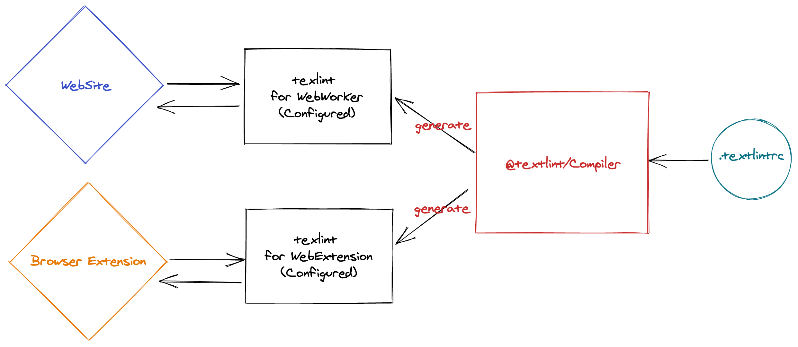

# @textlint/editor

textlint editor project.

## Usage

1. Install Web Extensions

- [ ] Chrome
- [ ] Firefox

2. Visit `textlint-worker.js` URL
3. Install the textlint worker script
4. After that, you can linting any supported textarea with your textlint worker script

### Browser Extensions

See [packages/webextension](packages/webextension/README.md)

## Supports textarea

- [x] textarea
- [ ] contenteditable
- [ ] Google Docs
- [ ] Twitter
- [ ] Medium
- [ ] Wordpress
- [ ] CodeMirror
- [ ] ACE

If you want to support new textarea, please create an issues or pull request
to [textchecker-element](./packages/textchecker-element).

## Purpose

- Privacy first
    - Offline works
- Create own textlint that is bundled with own configuration
    - Optimize your needs
    - [@textlint/script-compiler](packages/@textlint/script-compiler) is code generator

[Grammarly](https://grammarly.com/) and [Microsoft Editor](https://www.microsoft.com/microsoft-365/microsoft-editor) is
useful and high-quality linting tools, but these require network access, and you must pass your text to their server.

[textlint](https://github.com/textlint/textlint) can be works at offline. Because, textlint is written by JavaScript,
textlint rules are also written by JavaScript.

However, textlint is pluggable linting tools and textlint can not provide recommended/default ruleset.

@textlint/editor project resolve this issue using [@textlint/script-compiler](packages/@textlint/script-compiler) that
generate optimized code from your textlint configuration.

<!-- https://excalidraw.com/#json=5173529272123392,zEJpgAvspIPHh-IExwh69w -->

For example, WebExtension download own optimized textlint that is generated
code [@textlint/script-compiler](packages/@textlint/script-compiler), and use it for linting.

So, we can focus on the compiler and frontend of editor.

## Develop

Install with yarn and build before editing files.

    yarn install
    yarn run build
    cd packages/you want to edit

## Architecture

- FrontEnd
    - [textchecker-element](packages/textchecker-element) is general web component implementation.
    - Injectable code
    - View
    - multiple implementations
    - For VSCode, TextArea, Google Docs
- BackEnd
    - Web Extension: background.js
    - Server: API server
    - Web Worker: thread
    - spellchecker backend api

FrontEnd and BackEnd is separated.

### WebComponent

Avoid side-effect on website.

- TextChecker
- Controller
- Portal Overlay

### Compiler target

[@textlint/script-compiler](packages/@textlint/script-compiler) generate bundled JavaScript code.

Compiler compilertextlint + rule + textlintrc into a single library code.

- Chrome Extension code
    - chrome.storage.local for cache
    - libraryTarget:
- Web Worker code
    - kvstorage cache
    - libraryTarget: self
- Main Thread code(just web)
    - kvstorage cache
    - libraryTarget: web

Also, We can provide [@textlint/script-compiler](packages/@textlint/script-compiler) as a service
using [codesandbox](https://codesandbox.io)

### API

The library has some API

- update(config): Promise<void>
    - dynamic update textlintrc config
- lint({text:string}): { range: [number, number], message: string, suggestions: suggesionItem[] };
- fix({ range: [number,number] }): string;
- suggest({ range: [number, numbe })`
    - missing parts of textlint
- `ignore({ word:string }): Promise<void>`
    - [textlint-filter-rule-allowlist](https://github.com/textlint/textlint-filter-rule-allowlist) configuration?

## Changelog

See [Releases page](https://github.com/textlint/editor/releases).

## Running tests

Install devDependencies and Run `npm test`:

    npm test

## Contributing

Pull requests and stars are always welcome.

For bugs and feature requests, [please create an issue](https://github.com/textlint/editor/issues).

1. Fork it!
2. Create your feature branch: `git checkout -b my-new-feature`
3. Commit your changes: `git commit -am 'Add some feature'`
4. Push to the branch: `git push origin my-new-feature`
5. Submit a pull request :D

## Author

- [github/azu](https://github.com/azu)
- [twitter/azu_re](https://twitter.com/azu_re)

## License

MIT © azu
